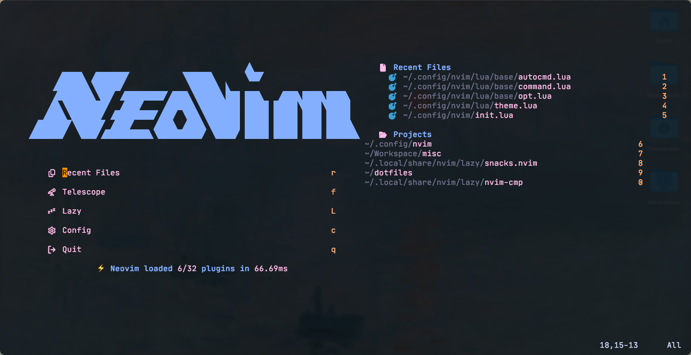
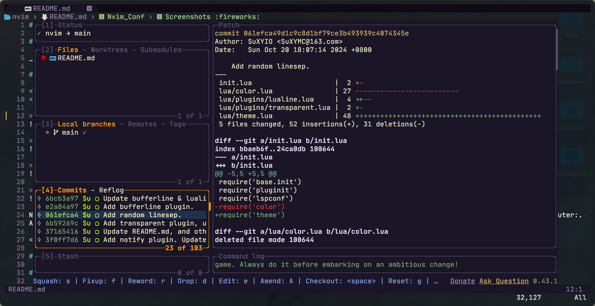

# Nvim_Conf

## Intro

SuXYIO's Neovim config. 

## Screenshots

Screenshots

Editing markdown with _tree view_, _code outline_, _telescope_ on, _tokyonight_ colorscheme. 

Opening a terminal and viewing _signal.c_ with _less_ <s>(dumb thing to want to do)</s>, and opening a _code outline_, _material_ colorscheme. 

## Info

### Plugin

Manager: [Lazy.nvim](https://github.com/folke/lazy.nvim)

Plugin list

| Plugin | Description | Lazy |
| ------ | ----------- | ---- |
| [Autopairs](https://github.com/windwp/nvim-autopairs) | Better insert experience for paired characters | Event`InsertEnter` |
| [NvimCmp](https://github.com/hrsh7th/nvim-cmp) | Provide completion | Event `InsertEnter` |
| [Codeium](https://github.com/Exafunction/codeium.nvim) | Provide AI assist | Cmd `Codeium` |
| [Dashboard](https://github.com/nvimdev/dashboard-nvim) | Startup dashboard | Event `VimEnter` |
| [GitSign](https://github.com/lewis6991/gitsigns.nvim) | Show changes for git | Event `VimEnter` |
| [LeetCode](https://github.com/kawre/leetcode.nvim) | Leetcode inside nvim | Cmd `Leet` |
| [LspConfig](https://github.com/neovim/nvim-lspconfig) | Provide LSP configuration | Event `VimEnter` |
| [LspSaga](https://github.com/nvimdev/lspsaga.nvim) | Better LSP experience | Event `VimEnter` |
| [Lualine](https://github.com/nvim-lualine/lualine.nvim) | Provide fancy lines and tabs | Event `VimEnter` |
| [Mason](https://github.com/williamboman/mason.nvim) | Install LSPs | Event `VimEnter` |
| [MarkdownPreview](https://github.com/iamcco/markdown-preview.nvim) | Preview markdown files | Cmd `MarkdownPreviewToggle, MarkdownPreview, MarkdownPreviewStop`; Ft `markdown` |
| [Telescope](https://github.com/nvim-telescope/telescope.nvim) | Find files | Cmd `Telescope` |
| [TodoComments](https://github.com/folke/todo-comments.nvim) | Highlight todo comments | Event `VimEnter` |
| [Transparent](https://github.com/xiyaowong/transparent.nvim) | Provide transparent background | Event `VimEnter` |
| [NvimTree](https://github.com/nvim-tree/nvim-tree.lua) | Provide tree view | Keys <kbd>Ctrl</kbd>-<kbd>N</kbd> |

### LSP

Manager: [Mason.nvim](https://github.com/williamboman/mason.nvim)

The autoload feature in Mason is enabled, just install the LSPs needed, no need to config every single one. 

### Keymap

Keymap list

#### Base

| Mode | Key | Map | Description |
| ---- | --- | --- | ----------- |
| / | <kbd>;</kbd> | `leader` | Leader key |
| N | <kbd>Cmd</kbd>-<kbd>C</kbd> | `"+y` | Copy to system clipboard |
| N | <kbd>Cmd</kbd>-<kbd>V</kbd> | `"+P` | Paste from system clipboard in normal mode |
| I | <kbd>Cmd</kbd>-<kbd>V</kbd> | `<Esc>"+P` | Paste from system clipboard in insert mode |
| N | <kbd>Cmd</kbd>-<kbd>S</kbd> | `<CMD>w<CR>` | Save file |
| I | <kbd>j</kbd><kbd>L</kbd> | `<Esc>` | Escape from insert mode |
| N | <kbd>Space</kbd> | `:` | Go to command mode |
| N | <kbd>Ctrl</kbd>-<kbd>K</kbd> | `ddkP` | Move line up |
| N | <kbd>Ctrl</kbd>-<kbd>J</kbd> | `ddp` | Move line down |
| N | <kbd>Esc</kbd> | `<CMD>noh<CR>` | Remove highlight (clear search highlight) |
| N | <kbd>Ctrl</kbd>-<kbd>O</kbd> | `<CMD>bn<CR>` | Switch buffer |
| N | <kbd>Ctrl</kbd>-<kbd>I</kbd> | `<CMD>bd<CR>` | Close buffer |
| N | <kbd>Ctrl</kbd>-<kbd>H</kbd> | `<CMD>vs<CR>` | Vertical window split |
| N | <kbd>Ctrl</kbd>-<kbd>M</kbd> | `<CMD>terminal<CR>` | Open terminal |
| T | <kbd>J</kbd><kbd>K</kbd> | `<C-\\><C-n>` | Escape from terminal mode |

#### Plugin

| Plugin | Mode | Key | Map | Description |
| ------ | ---- | --- | --- | ----------- |
| NvimCmp | I | <kbd>Enter</kbd> | `cmp.mapping.confirm({select = true})` | Confirm completion |
| NvimCmp | I | <kbd>Tab</kbd> | `cmp.mapping.abort()` | Abort completion |
| LspSaga | N | <kbd>[</kbd><kbd>E</kbd> | `<CMD>Lspsaga diagnostic_jump_next<CR>` | Jump to next diagnostic |
| LspSaga | N | <kbd>[</kbd><kbd>Shift</kbd>-<kbd>E</kbd> | `<CMD>Lspsaga diagnostic_jump_next<CR>` | Jump to previous diagnostic |
| LspSaga | N | <kbd>Ctrl</kbd>-<kbd>S</kbd> | `<CMD>Lspsaga outline<CR>` | Show outline(structure) of code |
| LspSaga | N | <kbd>Ctrl</kbd>-<kbd>A</kbd> | `<CMD>Lspsaga code_action<CR>` | Show actions of code |
| MarkdownPreview | N | <kbd>Ctrl</kbd>-<kbd>B</kbd> | `<CMD>MarkdownPreviewToggle<CR>` | Toggle markdown preview |
| Telescope | N | <kbd>f</kbd><kbd>f</kbd> | `<CMD>Telescope find_files<CR>` | Telescope find files |
| Transparent | N | <kbd>T</kbd> | `<CMD>TransparentToggle<CR>` | Transparent toggle |
| NvimTree | N | <kbd>Ctrl</kbd>-<kbd>N</kbd> | `<CMD>NvimTreeToggle<CR>` | Toggle tree view |

### Colorscheme

- [Material](https://github.com/marko-cerovac/material.nvim)
- [Tokyonight](https://github.com/folke/tokyonight.nvim)
- [Ayu](https://github.com/Luxed/ayu-vim)
- [Gruvbox](https://github.com/morhetz/gruvbox)

#### Colorcycle

The program does a _Colorcycle_ every time on startup.  
You can choose between `Choose by time` or `Choose in list (random)` by modifying `lua/colorcycle.lua`.  
The time seperation is defined in `lua/timeseps.lua`.  
A few colorchemes also change it's own style by time, see lua files in `lua/colorschemes/`

### Font

Nerdfont is needed to show properly. 
I personally like [JetbrainsMono](https://www.jetbrains.com/lp/mono/). 

### Misc

#### Self-defined commands

Self-defined command list

| Command | Operation | Description |
| ------- | --------- | ----------- |
| `Hex` | `%!xxd` | Convert buffer raw to hex code |
| `Dehex` | `%!xxd -r` | Convert buffer hex code to raw |

#### Client support

The client [Neovide](https://neovide.dev/) is supported, see `lua/client.lua`. 

