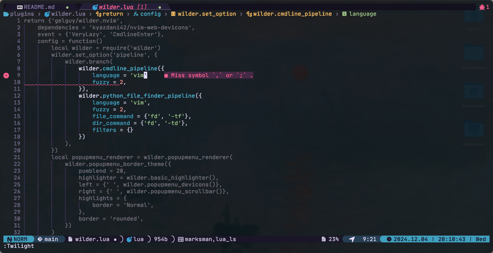
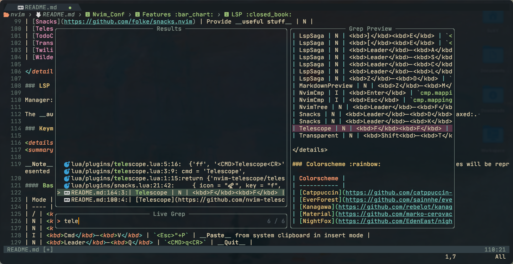

# Nvim_Conf

## Intro :information_source:

_SuXYIO_'s __Neovim__ config. 

## Screenshots :fireworks:

<details>
<summary>Screenshots</summary>

> Dashboard, _catppuccin_ colorscheme. 


> Lazygit, _kanagawa_ colorscheme. 


> Code inspecting, _duskfox_ colorscheme. 


> Telescope, _everforest_ colorscheme. 


> Markdown preview, _material_ colorscheme. 


Note that these screenshots may not represent the actual effect, which is dependent on the terminal / NeoVim client config :computer:.  
Also, these screenshots might be outdated due to my laziness :sleeping:. 

</details>

## Install :calling:

### Requirements :battery:

#### Basic

Install __[NeoVim](https://github.com/neovim/neovim)__ (Which I assume you have done since you're browsing this repo :sweat_smile:).  
Install __[Nerdfont](https://nerdfonts.com)__ for your _terminal_ or _NeoVim client_ :computer:.  
__[Git](https://git-scm.com)__ is recommended for cloning the repo, but you can also use tools like __wget__ or __curl__ :wrench:.  

### Simple :star:

:exclamation: Make sure you backup your current __NeoVim__ config :floppy_disk:.  

```bash
git clone https://github.com/suxyio/Nvim_Conf ~/.config/nvim
```

### Detailed :star2:

<details>

<summary>This will be a bit verbose</summary>

1. _Optional_  
Backup your current __NeoVim__ config :floppy_disk:. 
```bash
mv ~/.config/nvim ~/.config/nvim.bak
```

1. Clone this repo :satellite:.  
```bash
git clone https://github.com/suxyio/Nvim_Conf ~/.config/nvim
```
</details>

### Check Install :mag:

You're done! :tada:  
Startup __NeoVim__ to check if it works.  
If installed correctly, a grey _Lazy_ window will show up to clone the plugins. 
```bash
nvim
```
If any help is needed, feel free to report it in __Issues__ :wink:. 

Enjoy! :blush:

## Features :bar_chart:

### Plugin :electric_plug:

Manager: __[Lazy.nvim](https://github.com/folke/lazy.nvim)__ :zzz:

<details>
<summary>Plugin list</summary>

| Plugin | Description | Idle (You have to toggle manually) |
| ------ | ----------- | ---------------------------------- |
| [Autopairs](https://github.com/windwp/nvim-autopairs) | Better insert experience for __paired characters__ | N |
| [Bufferline](https://github.com/akinsho/bufferline.nvim) | Provide __bufferline__ | N |
| [Cmp](https://github.com/hrsh7th/nvim-cmp) | Provide __completion__ | N |
| [Codeium](https://github.com/Exafunction/codeium.nvim) | Provide __AI__ assist | Y |
| [Gitsigns](https://github.com/lewis6991/gitsigns.nvim) | Well, __gitsigns__, literally | N |
| [LspSaga](https://github.com/nvimdev/lspsaga.nvim) | Better __LSP experience__ | N |
| [Lualine](https://github.com/nvim-lualine/lualine.nvim) | Provide fancy __lines and tabs__ | N |
| [Mason](https://github.com/williamboman/mason.nvim) | __Install LSPs__ | N |
| [MarkdownPreview](https://github.com/iamcco/markdown-preview.nvim) | Preview __markdown__ files | N |
| [Notify](https://github.com/rcarriga/nvim-notify) | Notice __UI__ | N |
| [NvimTree](https://github.com/nvim-tree/nvim-tree.lua) | Provide __tree__ view | N |
| [Snacks](https://github.com/folke/snacks.nvim) | Provide __useful stuff__ | N |
| [Telescope](https://github.com/nvim-telescope/telescope.nvim) | __Find__ files | N |
| [TodoComments](https://github.com/folke/todo-comments.nvim) | Highlight __todo__ comments | Y |
| [Transparent](https://github.com/xiyaowong/transparent.nvim) | __Transparent__ background | N |
| [Wilder](https://github.com/gelguy/wilder.nvim) | Provide __cmdline completion__ | N |
| [ZenMode](https://github.com/folke/zen-mode.nvim) | Provide __zen mode__ | Y |

</details>

### LSP :closed_book:

Manager: __[Mason.nvim](https://github.com/williamboman/mason.nvim)__

The __autoload__ feature in _Mason_ is __enabled__, just install the LSPs needed, no need to config every single one :relaxed:. 

### Keymap :musical_keyboard:

<details>
<summary>Keymap list</summary>

__Note__: The single __characters__ here are all __capital__, which represents the key on the keyboard, capital key presses will be represented with <kbd>Shift</kbd>. 

#### Base :star:

| Mode | Key | Map | Description |
| ---- | --- | --- | ----------- |
| / | <kbd>;</kbd> | `leader` | __Leader__ key |
| N | <kbd>Cmd</kbd>-<kbd>C</kbd> | `"+y` | __Copy__ to system clipboard |
| N | <kbd>Cmd</kbd>-<kbd>V</kbd> | `"+P` | __Paste__ from system clipboard in normal mode |
| I | <kbd>Cmd</kbd>-<kbd>V</kbd> | `<Esc>"+P` | __Paste__ from system clipboard in insert mode |
| N | <kbd>Leader</kbd>-<kbd>Q</kbd> | `<CMD>q<CR>` | __Quit__ |
| N | <kbd>Leader</kbd>-<kbd>WW</kbd> | `<CMD>w<CR>` | __Save__ |
| N | <kbd>Leader</kbd>-<kbd>WA</kbd> | `<CMD>wa<CR>` | __Save all__ |
| N | <kbd>Leader</kbd>-<kbd>WQ</kbd> | `<CMD>wq<CR>` | __Save & Quit__ |
| I | <kbd>J</kbd><kbd>K</kbd> | `<Esc>` | __Escape__ from insert mode |
| N | <kbd>Space</kbd> | `:` | Go to __command__ mode |
| N | <kbd>Ctrl</kbd>-<kbd>K</kbd> | `ddkP` | __Move line__ up |
| N | <kbd>Ctrl</kbd>-<kbd>J</kbd> | `ddp` | __Move line__ down |
| N | <kbd>Esc</kbd> | `<CMD>noh<CR>` | Remove __highlight__ (clear search highlight) |
| N | <kbd>Leader</kbd>-<kbd>J</kbd> | `<CMD>bn<CR>` | Switch next __buffer__ |
| N | <kbd>Leader</kbd>-<kbd>H</kbd> | `<CMD>bp<CR>` | Switch previous __buffer__ |
| N | <kbd>Leader</kbd>-<kbd>W</kbd> | `<C-w>` | __Window__ control |
| N | <kbd>Z</kbd><kbd>L</kbd> | `<CMD>vs<CR>` | Toggle __vertical split__ |
| N | <kbd>Z</kbd><kbd>J</kbd> | `<CMD>sp<CR>` | Toggle __split__ |
| T | <kbd>Esc</kbd><kbd>Esc</kbd> | `<C-\\><C-n>` | __Escape__ from terminal mode |

#### Plugin :electric_plug:

| Plugin | Mode | Key | Map | Description |
| ------ | ---- | --- | --- | ----------- |
| LspSaga | N | <kbd>]</kbd><kbd>E</kbd> | `<CMD>Lspsaga diagnostic_jump_next<CR>` | __Jump__ to next __diagnostic__ |
| LspSaga | N | <kbd>[</kbd><kbd>E</kbd> | `<CMD>Lspsaga diagnostic_jump_prev<CR>` | __Jump__ to previous __diagnostic__ |
| LspSaga | N | <kbd>Leader</kbd>-<kbd>A</kbd> | `<CMD>Lspsaga code_action<CR>` | Show __actions__ of code |
| LspSaga | N | <kbd>Leader</kbd>-<kbd>S</kbd> | `<CMD>Lspsaga outline<CR>` | Show __outline__(structure) of code |
| LspSaga | N | <kbd>Leader</kbd>-<kbd>L</kbd> | `<CMD>Lspsaga term_toggle<CR>` | Toggle __terminal__ |
| LspSaga | N | <kbd>Z</kbd>-<kbd>D</kbd> | `<CMD>Lspsaga peek_definition<CR>` | Peek __definition__ |
| MarkdownPreview | N | <kbd>Z</kbd>-<kbd>M</kbd> | `<CMD>MarkdownPreviewToggle<CR>` | Toggle __markdown__ preview |
| NvimCmp | I | <kbd>Enter</kbd> | `cmp.mapping.confirm({select = true})` | Confirm __completion__ |
| NvimCmp | I | <kbd>Esc</kbd> | `cmp.mapping.abort()` | Abort __completion__ |
| NvimTree | N | <kbd>Leader</kbd>-<kbd>F</kbd> | `<CMD>NvimTreeToggle<CR>` | Toggle __tree__ view |
| Snacks | N | <kbd>Leader</kbd>-<kbd>D</kbd> | `<CMD>Snacks.lazygit()<CR>` | Toggle __LazyGit__ |
| Snacks | N | <kbd>Leader</kbd>-<kbd>K</kbd> | `<CMD>Snacks.bufdelete<CR>` | Delete __buffer__ |
| Telescope | N | <kbd>F</kbd><kbd>F</kbd> | `<CMD>Telescope<CR>` | __Telescope__ |
| Transparent | N | <kbd>Shift<kbd>-<kbd>T</kbd> | `<CMD>TransparentToggle<CR>` | __Transparent__ toggle |

</details>

### Colorscheme :rainbow:

| Colorscheme |
| ----------- |
| [Catppuccin](https://github.com/catppuccin-mocha) |
| [EverForest](https://github.com/sainnhe/everforest) |
| [Kanagawa](https://github.com/rebelot/kanagawa.nvim) |
| [Material](https://github.com/marko-cerovac/material.nvim) |
| [NightFox](https://github.com/EdenEast/nightfox.nvim) |

### theme change :traffic_light:

The `colorscheme`, `background`, `lineseps` can be different on every startup over a certain rule.  
(`random`, `time`, `random` is default)

### Font :book:

[Nerdfont](https://nerdfonts.com) is needed to show properly. 

### Misc :sparkles:

#### Self-defined commands :bookmark:

<details>
<summary>Self-defined command list</summary>

| Command | Description |
| ------- | ----------- |
| `Hex` | Convert buffer __raw to hex__ code. Convert back using `Hex!`. You can also add args directly, for example `Hex -p` will pass the `-p` to `xxd`. Requires `xxd` installed. |

</details>

#### Grammar check :abc:

Uses the built-in `SpellCheck`.  

#### Client support :computer:

The client __[Neovide](https://neovide.dev/)__ is supported, see `lua/client.lua`. 

## Todo

- [ ] Reduce startup time
- [ ] Add system status in lualine

